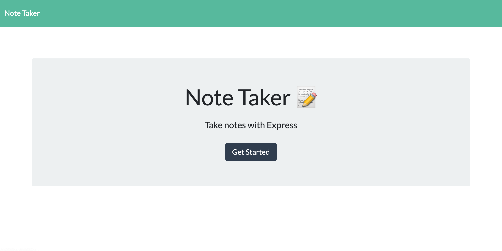
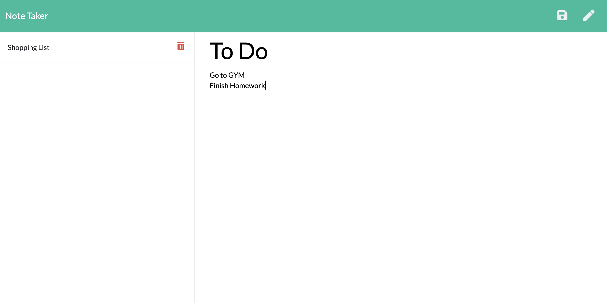

# Note Taker


## Description  
This application storage notes from a minimalist Website into an [Express](https://www.npmjs.com/package/express) server application deployed on [Heroku](https://www.heroku.com/). 





    
## Table of Contents   
* [User Story](#User-Story)
* [Acceptance Criteria](#Acceptance-Criteria)
* [Installation](#Installation)
* [Usage](#Usage)
* [Credits](#Credits)
* [License](#License)
* [Tests](#Tests)
* [Questions](#Questions)

## User Story

```
AS A small business owner
I WANT to be able to write and save notes
SO THAT I can organize my thoughts and keep track of tasks I need to complete
```

## Acceptance Criteria

```
GIVEN a note-taking application
WHEN I open the Note Taker
THEN I am presented with a landing page with a link to a notes page
WHEN I click on the link to the notes page
THEN I am presented with a page with existing notes listed in the left-hand column, plus empty fields to enter a new note title and the note’s text in the right-hand column
WHEN I enter a new note title and the note’s text
THEN a Save icon appears in the navigation at the top of the page
WHEN I click on the Save icon
THEN the new note I have entered is saved and appears in the left-hand column with the other existing notes
WHEN I click on an existing note in the list in the left-hand column
THEN that note appears in the right-hand column
WHEN I click on the Write icon in the navigation at the top of the page
THEN I am presented with empty fields to enter a new note title and the note’s text in the right-hand column
```

## Installation
1. Clone the repo.
2. Navigate to the project directory.
3. Run command ```npm install``` to install any dependencies.

## Usage    
* Navigate to the site.
* Click on Get Started.
* Enter a Note Title
* Enter a note.
* Click on the Save Icon.
* Select any previuos notes to view it.
* Click on the delete icon to remove a note.

For more details, please follow the [Demo Video](https://youtu.be/M_QWjgIXswg)

## Credits  
Developed by: 
Manuel Leung Chen ([GitHub](https://github.com/manuelleungchen))

Deployment Tools used: 
* [Express](https://www.npmjs.com/package/express)
* [Heroku](https://www.heroku.com/)
* [Uniqid](https://www.npmjs.com/package/uniqid)

Development Tools used:
* [Nodemon](https://www.npmjs.com/package/nodemon)

## License
Copyright (c) 2020 - Manuel Leung Chen

Licensed under the [MIT License](https://choosealicense.com/licenses/mit/).
 
## Tests
1. Navigate to the project folder.
2. Type ```npm run watch``` command. 
3. Press Enter.

## Questions
Manuel Leung Chen - [GitHub](https://github.com/manuelleungchen )

If you have any question about this application, please reach out me by [Email](manuel.leungchen@gmail.com)

